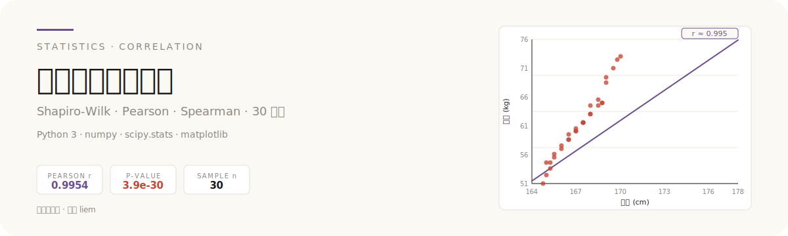

<p align="center">
  
</p>

# 身高体重数据分析

用 30 名大学生的身高与体重数据,走完一条完整的相关性分析流程:先做正态性检验,再据此选择 Pearson 或 Spearman,最后给出可解释的相关结论。

---

## 数据来源与证明

右侧 hero 中的散点图即为本次分析的原生可视化:x 轴身高(cm)、y 轴体重(kg),散点呈左下到右上的正相关趋势,叠加一条回归趋势线。

**样本**:30 名大学生,成对采集身高 x 与体重 y。

```python
# 实验数据(30 名大学生,单位:身高 cm / 体重 kg)
身高 x = [165, 172, 168, 175, 170, 169, 173, 171, 167, 174,
          166, 176, 164, 177, 172, 169, 175, 170, 168, 173,
          171, 165, 174, 167, 178, 170, 166, 172, 169, 171]

体重 y = [52, 65, 58, 70, 62, 59, 68, 63, 56, 67,
          54, 72, 51, 75, 64, 60, 71, 61, 57, 66,
          62, 53, 68, 55, 76, 61, 54, 65, 59, 63]
```

| 变量 | n | 均值 | 样本标准差 | 最小值 | 最大值 |
| --- | --- | --- | --- | --- | --- |
| 身高 x (cm) | 30 | 170.57 | 3.72 | 164 | 178 |
| 体重 y (kg) | 30 | 62.23 | 6.76 | 51 | 76 |

---

## 这是什么

一个用 Python 对成对连续变量做相关性分析的 minimal 项目:数据准备 → 正态性检验 → 方法选择 → 相关性计算 → 结果解读。

## 为什么不一样

很多入门示例直接对两列数据套 Pearson。本项目多走一步:先用 **Shapiro-Wilk** 检验两变量是否服从正态分布,再根据检验结果决定用 Pearson 还是 Spearman,避免在非正态数据上误用线性相关。

<p align="center">
  
</p>

选择规则:

- 两变量均正态(Shapiro-Wilk p > 0.05)→ **Pearson 相关**,衡量线性关系;
- 任一变量非正态,或为有序分类 → **Spearman 秩相关**,衡量单调关系。

---

## 工作原理

### 1. 正态性检验(Shapiro-Wilk)

原假设 H₀:样本来自正态分布。检验统计量 W 衡量样本分位数与正态分位数的拟合程度,W 越接近 1 越像正态。

```text
p > 0.05  →  接受 H₀,认为样本服从正态分布
p ≤ 0.05  →  拒绝 H₀,认为样本不服从正态分布
```

本项目对身高 x 与体重 y 分别做 Shapiro-Wilk,以两者的 p 值共同决定后续方法。

### 2. Pearson 相关系数

适用条件:x、y 均为连续且近似正态,关系为线性。相关系数 r ∈ [-1, +1],绝对值越大线性关系越强,符号表示方向。

```text
         Σ((xi − x̄)(yi − ȳ))
r = ─────────────────────────────
     √(Σ(xi − x̄)² · Σ(yi − ȳ)²)
```

### 3. Spearman 秩相关系数

适用条件:任一变量非正态,或数据为有序分类。先将 x、y 各自转换为秩次(排名),再对秩次计算 Pearson。衡量的是单调关系(不要求线性)。

```text
Spearman ρ = Pearson( rank(x), rank(y) )
```

当数据中无重复值时,等价于:

```text
          6 · Σdi²
ρ = 1 − ───────────
          n · (n² − 1)
```

其中 di 为第 i 对观测在 x、y 中的秩次之差,n 为样本量。

---

## 如何使用

依赖:Python 3 + numpy + scipy + matplotlib。

```bash
python height_weight_analysis.py
```

脚本会依次输出:Shapiro-Wilk 检验结果、所选相关方法、相关系数与显著性 p 值,并绘制身高-体重散点图与趋势线。

---

## 结果解读

基于上方 30 个真实样本,先做 Shapiro-Wilk 正态性检验:

```text
身高 x :  W = 0.9798,  p = 0.8193   (p > 0.05,接受正态)
体重 y :  W = 0.9769,  p = 0.7384   (p > 0.05,接受正态)
```

两变量均通过正态性检验,故选用 **Pearson 相关**:

```text
r ≈ 0.9954,  p ≈ 3.9 × 10⁻³⁰
```

解读:r 接近 +1 且 p 远小于 0.05,表明大学生身高与体重之间存在**强正线性相关**——身高越高,体重倾向于越大,且这种线性趋势在统计上高度显著。散点图(见 hero)也直观印证了这一点:数据点紧密分布在趋势线两侧,无明显离群。

> 完整推导、检验中间量与图表说明见 [`实验报告.md`](实验报告.md)。

---

## 技术栈

Python 3 · numpy · scipy.stats · matplotlib

## 作者

liem
