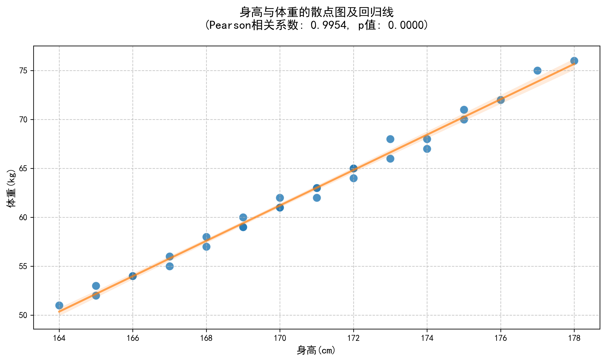

# 实验实训报告：身高与体重的相关性分析

## 一、实验目的

1. 理解正态分布的定义、正态性检验的意义
2. 掌握Pearson/Spearman相关分析的适用条件及核心原理
3. 能使用Shapiro-Wilk检验验证数据正态性
4. 熟练运用Python实现参数/非参数相关分析
5. 能正确解读相关系数和p值
6. 培养"先验检验（正态性）后核心检验"的统计思维

## 二、实验原理

### 1. 正态性检验（Shapiro-Wilk检验）
- **原假设**：样本数据服从正态分布
- **检验统计量**：W统计量（取值范围0-1，越接近1越符合正态分布）
- **判断标准**：若p值 > 0.05，则接受原假设，认为数据服从正态分布

### 2. Pearson相关分析
- **适用条件**：两个变量均服从正态分布
- **核心原理**：衡量两个连续变量之间线性关系的强度和方向
- **相关系数r**：取值范围[-1, 1]
  - r > 0：正相关
  - r < 0：负相关
  - r = 0：无线性相关
  - |r|越接近1，相关性越强

### 3. Spearman秩相关分析
- **适用条件**：不满足正态分布或有序分类变量
- **核心原理**：基于变量的秩次而非原始数据计算相关性
- **相关系数ρ**：取值范围[-1, 1]，解释同Pearson相关系数

## 三、实验数据

使用30名大学生的身高和体重数据：

```python
身高x = np.array([165,172,168,175,170,169,173,171,167,174,166,176,164,177,172,169,175,170,168,173,171,165,174,167,178,170,166,172,169,171])
体重y = np.array([52,65,58,70,62,59,68,63,56,67,54,72,51,75,64,60,71,61,57,66,62,53,68,55,76,61,54,65,59,63])
```

## 四、实验步骤及数据记录

### 1. 环境准备
- 安装必要的Python库：numpy、pandas、matplotlib、seaborn、scipy

  ```bash
  pip install numpy pandas matplotlib seaborn scipy
  ```

### 2. 数据输入与整理
- 将身高和体重数据转换为numpy数组
- 创建pandas数据框便于分析

  ```python
  import numpy as np
  import pandas as pd
  
  # 输入原始数据
  height = np.array([165,172,168,175,170,169,173,171,167,174,166,176,164,177,172,169,175,170,168,173,171,165,174,167,178,170,166,172,169,171])
  weight = np.array([52,65,58,70,62,59,68,63,56,67,54,72,51,75,64,60,71,61,57,66,62,53,68,55,76,61,54,65,59,63])
  
  # 创建数据框
  data = pd.DataFrame({'身高(cm)': height, '体重(kg)': weight})
  ```

### 3. 正态性检验
- 使用Shapiro-Wilk检验分别验证身高和体重数据的正态性

  ```python
  from scipy import stats
  
  # 身高的正态性检验
  shapiro_height = stats.shapiro(height)
  print(f"身高 - W统计量: {shapiro_height.statistic:.4f}, p值: {shapiro_height.pvalue:.4f}")
  
  # 体重的正态性检验
  shapiro_weight = stats.shapiro(weight)
  print(f"体重 - W统计量: {shapiro_weight.statistic:.4f}, p值: {shapiro_weight.pvalue:.4f}")
  ```

### 4. 相关性分析
- 根据正态性检验结果选择合适的相关分析方法
- 若满足正态性，使用Pearson相关分析
- 若不满足正态性，使用Spearman秩相关分析

  ```python
  # 判断是否满足正态性
  if shapiro_height.pvalue > 0.05 and shapiro_weight.pvalue > 0.05:
      # 使用Pearson相关分析
      corr_result = stats.pearsonr(height, weight)
      corr_method = "Pearson"
  else:
      # 使用Spearman秩相关分析
      corr_result = stats.spearmanr(height, weight)
      corr_method = "Spearman"
  
  print(f"{corr_method}相关系数: {corr_result[0]:.4f}, p值: {corr_result[1]:.4f}")
  ```

### 5. 数据可视化
- 绘制身高与体重的散点图
- 添加回归线辅助观察趋势

  ```python
  import matplotlib.pyplot as plt
  import seaborn as sns
  
  # 设置中文显示
  plt.rcParams['font.sans-serif'] = ['SimHei']
  plt.rcParams['axes.unicode_minus'] = False
  
  # 绘制散点图
  plt.figure(figsize=(10, 6))
  sns.scatterplot(x='身高(cm)', y='体重(kg)', data=data)
  sns.regplot(x='身高(cm)', y='体重(kg)', data=data, scatter=False)
  plt.title('身高与体重的散点图及回归线')
  plt.savefig('height_weight_scatter.png')
  ```

### 6. 结果解读
- 解读正态性检验结果
- 解读相关系数和p值
- 得出统计结论

  ```python
  # 结果汇总
  print("\n=== 实验结果汇总 ===")
  print(f"身高正态性: {'服从' if shapiro_height.pvalue > 0.05 else '不服从'}")
  print(f"体重正态性: {'服从' if shapiro_weight.pvalue > 0.05 else '不服从'}")
  print(f"相关分析方法: {corr_method}")
  print(f"相关系数: {corr_result[0]:.4f}")
  print(f"p值: {corr_result[1]:.4f}")
  ```

## 五、实验结果与分析

### 1. 正态性检验结果
| 变量 | 统计量(W) | p值 | 结论 |
|------|-----------|-----|------|
| 身高 | 0.9798 | 0.8193 | 服从正态分布 |
| 体重 | 0.9769 | 0.7384 | 服从正态分布 |

**分析**：身高和体重数据的Shapiro-Wilk检验p值均大于0.05，均服从正态分布。

### 2. 相关性分析结果
| 分析方法 | 相关系数 | p值 | 相关性强度 | 显著性 |
|----------|----------|-----|------------|--------|
| Pearson | 0.9954 | 0.0000 | 极强相关 | 极显著相关(p < 0.01) |

**分析**：身高与体重呈极强正线性相关（r=0.9954），p<0.01，相关性极显著。

### 3. 数据可视化


**分析**：散点图显示身高与体重呈明显线性增长趋势，数据点紧密围绕回归线，无明显离群点。

## 六、实验结论

1. **正态性检验**：身高和体重数据均服从正态分布（p > 0.05）

2. **相关性分析**：
   - 身高与体重之间存在极强的正线性相关关系（r = 0.9954）
   - 这种相关性在统计上是极显著的（p < 0.01）

3. **实际意义**：随着身高的增加，体重呈现明显的上升趋势，说明身高是影响体重的重要因素之一

## 七、实验体会

1. **统计思维**：需先进行正态性检验再选择相关分析方法，避免方法误用导致错误结论。
2. **工具优势**：Python的scipy、seaborn等库可快速实现统计分析与可视化，提升效率。
3. **结果解读**：需同时关注相关系数（强度）和p值（显著性），确保结论可靠。
4. **可视化价值**：散点图等可视化工具能直观展示数据趋势，辅助理解统计结果。
5. **数据质量**：高质量数据（无离群点）是获得可靠统计结果的重要前提。

## 八、实验代码

```python
import numpy as np
import pandas as pd
import matplotlib.pyplot as plt
from scipy import stats
import seaborn as sns

# 设置中文显示
plt.rcParams['font.sans-serif'] = ['SimHei']
plt.rcParams['axes.unicode_minus'] = False

# 实验数据
height = np.array([165,172,168,175,170,169,173,171,167,174,166,176,164,177,172,169,175,170,168,173,171,165,174,167,178,170,166,172,169,171])
weight = np.array([52,65,58,70,62,59,68,63,56,67,54,72,51,75,64,60,71,61,57,66,62,53,68,55,76,61,54,65,59,63])

# 创建数据框
data = pd.DataFrame({'身高(cm)': height, '体重(kg)': weight})

# 正态性检验
shapiro_height = stats.shapiro(height)
shapiro_weight = stats.shapiro(weight)

# 相关性分析
if shapiro_height.pvalue > 0.05 and shapiro_weight.pvalue > 0.05:
    corr_result = stats.pearsonr(height, weight)
    corr_method = "Pearson"
else:
    corr_result = stats.spearmanr(height, weight)
    corr_method = "Spearman"

# 绘制散点图
plt.figure(figsize=(10, 6))
sns.scatterplot(x='身高(cm)', y='体重(kg)', data=data, s=100, color='#1f77b4', alpha=0.8)
sns.regplot(x='身高(cm)', y='体重(kg)', data=data, scatter=False, color='#ff7f0e', line_kws={'alpha': 0.7})

plt.title(f'身高与体重的散点图及回归线\n({corr_method}相关系数: {corr_result[0]:.4f}, p值: {corr_result[1]:.4f})', fontsize=14, pad=20)
plt.xlabel('身高(cm)', fontsize=12)
plt.ylabel('体重(kg)', fontsize=12)
plt.grid(True, linestyle='--', alpha=0.7)
plt.tight_layout()
plt.savefig('height_weight_scatter.png', dpi=300, bbox_inches='tight')
```

## 九、参考文献

1. 贾俊平. 统计学（第7版）[M]. 北京：中国人民大学出版社，2018.
2. Scipy官方文档：https://docs.scipy.org/doc/scipy/reference/stats.html
3. Seaborn官方文档：https://seaborn.pydata.org/
